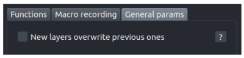

# :herb: napari-tapenade-processing

A collection of methods to process images of deep 3D/3D+time tissues in Napari.

`napari-tapenade-processing` is a [napari] plugin that is part of the [Tapenade](https://github.com/GuignardLab/tapenade) project. Tapenade is a tool for the analysis of dense 3D tissues acquired with deep imaging microscopy. It is designed to be user-friendly and to provide a comprehensive analysis of the data.

If you use this plugin for your research, please [cite us](https://github.com/GuignardLab/tapenade/blob/main/README.md#how-to-cite).

## Overview

While working with large and dense 3D and 3D+time gastruloid datasets, we found that being able to visualise and interact with the data dynamically greatly helped processing it.
During the pre-processing stage, dynamical exploration and interaction led to faster tuning of the parameters by allowing direct visual feedback, and gave key biophysical insight during the analysis stage.

From a given set of raw images, segmented object instances, and object mask, the plugin allows the user to quickly run all pre-processing functions from our main pipeline with custom parameters while being able to see and interact with the result of each step. For large datasets that are cumbersome to manipulate or cannot be loaded in Napari, the plugin provides a macro recording feature: the users can experiment and design their own pipeline on a smaller subset of the dataset, then run it on the full dataset without having to load it in Napari.

## Installation

The plugin obviously requires [napari] to run. If you don't have it yet, follow the instructions [here](https://napari.org/stable/tutorials/fundamentals/installation.html).

The simplest way to install `napari-tapenade-processing` is via the [napari] plugin manager. Open Napari, go to `Plugins > Install/Uninstall Packages...` and search for `napari-tapenade-processing`. Click on the install button and you are ready to go!

You can also install `napari-tapenade-processing` via [pip]:

    pip install napari-tapenade-processing

To install latest development version :

    pip install git+https://github.com/jules-vanaret/napari-tapenade-processing.git

## Usage

### General overview of the plugin within Napari

To start a pre-processing pipeline, follow these steps:

1. First, load your images in Napari. You can drag and drop them from your file explorer to the Napari viewer, or open them using the `File > Open files...` menu.
2. Click on the `Plugins > Tapenade Processing` menu to open the plugin.
3. The image you have loaded will be displayed as individual layers in the Layer List. They can be clicked-on to reveal a set of visual parameters (see 4) that can be adjusted. By double-clicking on a layer name, you can change it. Right-clicking a layer will give you several options. The little eye icon next to the layer name can be clicked to hide the layer.
4. You can adjust visual parameters for each layer, like the contrast limits, the colormap, the opacity, the blending mode, etc.
5. If you want to switch between 2D and 3D views, click on the `Toggle 2D/3D view` button (it resembles a square when in 2D mode, or a cube when in 3D mode).
6. You can toggle the grid view (as shown in the example image) by clicking on the `Toggle grid mode` button. By right-clicking the button, you can parametrize the grid view (e.g number of columns, number of rows, etc).
7. The plugin is composed of three tabs. The first tab is dedicated to pre-processing functions, the second tab is dedicated to the macro recording feature, and the third tab is dedicated to advanced parameters.

### Tab 1: The pre-processing functions

The pre-processing tab is composed of the following elements:

1. A combo box to select the pre-processing function to apply from a list.
2. A set of comboxes that allow you to select the layers to apply the function on. If a function does not require a specific layer, the combo box will be greyed out. `Image` layers correspond to integer or float data, `Labels` layers correspond to integer data and represent segmented object instances, `Mask` layers correspond to boolean data and usually represent the sample's large scale mask (inside/outside). All layers must have data of the same shape (same number of dimensions and same dimensions). Layers can be 3D or 3D+time, respectively with the ZYX or TZYX order.
(2') If a layer does not appear in a combo box, but is present in the Layer List, you can click on the `Refresh` button to update the list of layers.
3. A set of parameters that you can tune to adjust the function's behaviour. The parameters are specific to each function. In case of doubt, you can hover over the parameter name/widget to get a tooltip with a description.
4. A `Run function` button to apply the function with the current parameters to the previously selected layers.

### Tab 2: The macro recording feature

In progress...

### Tab 3: Advanced parameters

The advanced parameters tab is composed of the following elements:

1. A checkbox `New layers overwrite previous ones`: whether the output of the pre-processing functions should be saved as new layers or overwrite the previous ones that were used as input. This can be useful to save memory when you don't need to compare the input and output of a function.
2. A checkbox `Results are cropped using mask`: whether the output of functions are systematically cropped using the mask layer (if it is provided). This can be useful to save memory when you don't need to process the whole image.
3. A slider `# parallel jobs`: the number of parallel jobs to use when running a function on a 3D+time input (each frame is processed in parallel). This can be useful to speed up the processing.

## Contributing

Contributions are very welcome. Tests can be run with [tox], please ensure
the coverage at least stays the same before you submit a pull request.

## License

Distributed under the terms of the [MIT] license,
"napari-tapenade-processing" is free and open source software

## Issues

If you encounter any problems, please [file an issue] along with a detailed description.

----------------------------------

This [napari] plugin was generated with [Cookiecutter] using [@napari]'s [cookiecutter-napari-plugin] template.

[napari]: https://github.com/napari/napari
[Cookiecutter]: https://github.com/audreyr/cookiecutter
[@napari]: https://github.com/napari
[MIT]: http://opensource.org/licenses/MIT
[BSD-3]: http://opensource.org/licenses/BSD-3-Clause
[GNU GPL v3.0]: http://www.gnu.org/licenses/gpl-3.0.txt
[GNU LGPL v3.0]: http://www.gnu.org/licenses/lgpl-3.0.txt
[Apache Software License 2.0]: http://www.apache.org/licenses/LICENSE-2.0
[Mozilla Public License 2.0]: https://www.mozilla.org/media/MPL/2.0/index.txt
[cookiecutter-napari-plugin]: https://github.com/napari/cookiecutter-napari-plugin

[file an issue]: https://github.com/jules-vanaret/napari-tapenade-processing/issues

[napari]: https://github.com/napari/napari
[tox]: https://tox.readthedocs.io/en/latest/
[pip]: https://pypi.org/project/pip/
[PyPI]: https://pypi.org/
